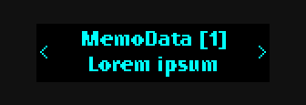
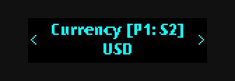
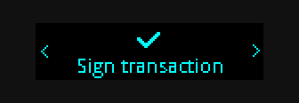

# XRP Wallet App for Ledger devices

[](https://github.com/LedgerHQ/app-xrp/actions/workflows/guidelines_enforcer.yml)

[](https://github.com/LedgerHQ/app-xrp/actions/workflows/build_and_functional_tests.yml)

## Introduction

This repository contains the source code for the XRP wallet app
that makes it possible to securely store XRP and assets issued
on the XRP Ledger using Ledger Nano devices.

To add Ledger Nano S and Ledger Nano X support in your application, please see the
NPM package [hw-app-xrp](https://www.npmjs.com/package/@ledgerhq/hw-app-xrp)
and the examples below.

## Features

The XRP wallet app comes with the following features:

- Support for all transaction types:
  - AMMBid
  - AMMCreate
  - AMMDelete
  - AMMDeposit
  - AMMVote
  - AMMWithdrawal
  - AccountSet
  - AccountDelete
  - CheckCancel
  - CheckCash
  - CheckCreate
  - Clawback
  - DepositPreauth
  - EscrowCancel
  - EscrowCreate
  - EscrowFinish
  - NFTokenAcceptOffer
  - NFTokenBurn
  - NFTokenCancelOffer
  - NFTokenCreateOffer
  - NFTokenMint
  - OfferCancel
  - OfferCreate
  - Payment
  - PaymentChannelClaim
  - PaymentChannelCreate
  - PaymentChannelFund
  - SetRegularKey
  - SignerListSet
  - TicketCancel
  - TicketCreate
  - TrustSet
- Support for all transaction common fields such as memos
- Support for issued assets such as SOLO, stocks and ETFs
- Support for signing on behalf of others
- Support for multi-signing
- Unified UI across Ledger Nano devices

## User Interface

The user interface primarily consists of the idle menu and the transaction
review menu.

### Idle Menu

Upon starting the app on your device you are immediately greeted by
the idle menu. This menu, as the name implies, is used when the device is in
its idle state. At this point, an external application may initiate a
transaction, which opens up the review menu.


### Review Menu

When reviewing a transaction the entire UI is dedicated to displaying the
transaction details. You can page through all the details by using the left
and right buttons on your device, as indicated by arrows on the screen.


Fields in arrays are suffixed with their array index in square brackets. See example below.



PathSet fields have their index information shown in square brackets on the
form `[Pi: Sj]`, where `i` is the path index and `j` is the step index within
that path. See example below.



In order to take action on the transaction, you must first page through and review all transaction details.
The last two items in the review menu are 'Sign transaction' and 'Reject'.



Page to either 'Sign transaction' or 'Reject' and press both buttons simultaneously to confirm your action.

## Usage

In order to initiate transactions from NodeJS or a browser client, the library
[hw-app-xrp](https://www.npmjs.com/package/@ledgerhq/hw-app-xrp) can be used.

An example of a basic payment transaction using this library is shown below:

```javascript
import Transport from "@ledgerhq/hw-transport-node-hid";
// import Transport from "@ledgerhq/hw-transport-u2f"; // for browser
import Xrp from "@ledgerhq/hw-app-xrp";
import { encode } from "ripple-binary-codec";

function establishConnection() {
  return Transport.create().then((transport) => new Xrp(transport));
}

function fetchAddress(xrp) {
  return xrp.getAddress("44'/144'/0'/0/0").then((deviceData) => {
    return {
      xrp,
      address: deviceData.address,
      publicKey: deviceData.publicKey.toUpperCase(),
    };
  });
}

function signTransaction(context, transaction) {
  const preparedTransaction = {
    Account: context.address,
    SigningPubKey: context.publicKey,
    ...transaction,
  };

  const transactionBlob = encode(preparedTransaction);

  console.log("Sending transaction to device for approval...");
  return context.xrp.signTransaction("44'/144'/0'/0/0", transactionBlob);
}

const transactionJSON = {
  TransactionType: "Payment",
  Destination: "rTooLkitCksh5mQa67eaa2JaWHDBnHkpy",
  Amount: "1000000",
  Fee: "15",
  Flags: 2147483648,
  Sequence: 57,
};

establishConnection()
  .then((xrp) => fetchAddress(xrp))
  .then((context) => signTransaction(context, transactionJSON))
  .then((signature) => console.log(`Signature: ${signature}`))
  .catch((e) => console.log(`An error occurred (${e.message})`));
```

### Advanced Usage

#### Multi-signing a Transaction

It is also possible to perform parallel multi-signing using the XRP wallet
app. This is done by sourcing a list of signatures for the transaction
and appending them to the `Signers` field of the transaction before submitting
it for processing. An example of combining a couple of externally sourced signatures
with a signature of the Ledger device is shown below (uses imports and functions declared in previous example).

```javascript
const transactionJSON = {
  Account: "r4PCuDkjuV2e23xVP8ChkVxo1aG2Ufpkjb",
  TransactionType: "Payment",
  Destination: "rTooLkitCksh5mQa67eaa2JaWHDBnHkpy",
  Amount: "1000000",
  Fee: "15",
  Flags: 2147483648,
  Sequence: 47,
  SigningPubKey: "", // Must be blank
};

// Sourced externally from other signing parties, replace "..." with actual values.
const otherSigners = [
  {
    Signer: {
      Account: "...",
      SigningPubKey: "...",
      TxnSignature: "...",
    },
  },
  {
    Signer: {
      Account: "...",
      SigningPubKey: "...",
      TxnSignature: "...",
    },
  },
];

function retrieveSignerData(transaction) {
  return establishConnection()
    .then((xrp) => fetchAddress(xrp))
    .then((context) => {
      return signTransaction(context, transaction).then((signature) => {
        return {
          Signer: {
            Account: context.account,
            SigningPubKey: context.publicKey,
            TxnSignature: signature.toUpperCase(),
          },
        };
      });
    })
    .catch((e) => console.log(`An error occurred (${e.message})`));
}

retrieveSignerData(transactionJSON)
  .then((signer) => {
    return {
      ...transactionJSON,
      Signers: [...otherSigners, signer],
    };
  })
  .then((transaction) => console.log(transaction))
  .catch((e) => console.log(`An error occurred (${e.message})`));
```

### Additional Notes

From version 2.0.0 of the XRP wallet app it is possible to sign larger
transactions than in previous versions. In order to enable support for larger transactions,
there have been slight modifications to the transport protocol, which is used to
communicate between the client and the device.

The protocol changes are fully backwards-compatible with previous versions of
[hw-app-xrp](https://www.npmjs.com/package/@ledgerhq/hw-app-xrp), but in order
to sign larger transactions you must use version 5.12.0 or above of [hw-app-xrp](https://www.npmjs.com/package/@ledgerhq/hw-app-xrp).

### Limitations

Because of resource constraints the following limits apply for the respective
hardware wallet:

#### Ledger Nano S

- Maximum fields per transaction: 24 fields
- Maximum displayed field value length: 128 characters
- Maximum transaction size: 800 bytes
- Maximum number of elements per array field: 8 elements
- Multi-sign support: Parallel only

#### Ledger Nano X

- Maximum fields per transaction: 60 fields
- Maximum displayed field value length: 1024 characters
- Maximum transaction size: 10 000 bytes
- Maximum number of elements per array field: 8 elements
- Multi-sign support: Parallel only

## Building

Make sure that you have configured a development environment as outlined in [the development
documentation](https://ledger.readthedocs.io/en/latest/userspace/getting_started.html)
for Ledger devices. Then run make from the repository root to build the app:

```sh
make
```

## Installing

To upload the app to your device, run the following command:

```sh
make load
```

## Testing

Manual testing can be conducted with the help of the testing utility
[TowoLabs/ledger-tests-xrp](https://github.com/TowoLabs/ledger-tests-xrp).
Make sure that your device is running the latest firmware and then follow
the instructions in the test repository.
